# TurboControls LCL Library

Copyright (c) 2025-2026 Turborium    
[github.com/turborium/TurboControls](github.com/turborium/TurboControls)  
Telegram: [@turborium](https://t.me/turborium)    

**TurboControls** is a **LCL** component library providing UI controls for **Lazarus**/**Free Pascal**.  
At the moment, the library mainly contains controls for working with color.  
The package does not use any non-standard units, only standard **LCL**/**FPC** units.  
All components work correctly with High-DPI and have full support for input focus.

## License

You can choose one of two licenses:

- Turborium Modified MIT License
- GPL v3

See [LICENSE.txt](LICENSE.txt) for the full license text of the **Turborium Modified MIT License**.  

*Users may obtain a commercial version of this software without the requirement to display the "About" notice in their application. Such commercial license is available directly from Turborium under separate terms and conditions.* 

## Overview

- Linear pickers (horizontal/vertical) for single components: HSL, HSV, RGB, Alpha.
- 2D axis pickers for selecting two components at once (for example: Hue \* Saturation or Red \* Green).
- A color cell control for showing or picking a single color with alpha preview support.

## Installation

Quick steps to install and use `TurboControls` in Lazarus:

- Open **TurboControlsPackage.lpk** in Lazarus.
- Click **Compile** button in **"Package"** window.
- Click **Use->Install** button.
- Choose **"Yes"** button in **"Rebuild Lazarus"** dialog.
- Wait...
- Done.

After installation, the components will appear in the `TurboControls` palette group.

## Controls

### TTurboColorCell

A visual color cell that displays a color (with alpha preview). Can be used as an interactive color swatch for display or selection.

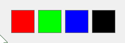

**Main properties:**
- `Value`: The displayed color value.
- `AlphaPreview`: Alpha preview opacity used when rendering transparency preview.
- `Background`: Appearance settings for checkerboard/transparent settings.
- `Interactive`: Enable interactive behavior (responds to clicks and focus); when
	 enabled the control can act as a clickable color swatch.
- `Selected`: Visual selection state; used by container controls or selection logic to
	 indicate the cell is selected.
- `Selection`: Appearance settings for the selection frame (colors,
	 opacity and pressed/hover states).

---

### TTurboAlphaLinePicker

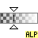

A linear picker for the alpha channel (0..255) with transparent background preview.

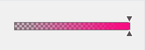

**Main properties:**
- `Alpha`: Alpha value controlled by the picker (0..255).
- `Min`: Minimum value of the picker range.
- `Max`: Maximum value of the picker range.
- `Reverse`: Invert the value-to-position mapping.
- `ColorPreview`: Base color used when previewing alpha.
- `ColorModulation`: Enable color modulation in the range preview.
- `RangeBackground`: Appearance settings for checkerboard/transparent settings.
- `PreviewStyle`: Preview visualization style (gradient/lines) without color modulation.
- `Orientation`: Control orientation (`Horizontal`, `Vertical`).
- `Layout`: Visual arrangement of the thumb(s) and arrows (`ExternalArrows`, `InternalArrows`, `CenterArrows`, `OverlapBox`, `InsideBox`).
- `ThumbLayout`: Which thumbs are visible (`First`, `Second`, `Both`).
- `ThumbSize`: Thumb size settings (Width/Height or Auto).
- `PositionLineVisible`: Show a position indicator line on the range.
- `ForceRepaint`: Force immediate repaint when the picker or its range changes.

---

### TTurboRgbLinePicker

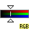

A linear RGB picker used to edit a single channel (`Red`, `Green`, `Blue`).

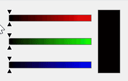

**Main properties:**
- `Red`, `Green`, `Blue`: Channel values (0..255) shown/edited by the picker.
- `Kind`: Selected channel (`Red`, `Green`, `Blue`).
- `Min`: Minimum value of the picker range.
- `Max`: Maximum value of the picker range.
- `Reverse`: Invert the value-to-position mapping.
- `CurrentColor`: Helper property to get/set the combined RGB color.
- `ColorModulation`: Enable color modulation in the range preview.
- `AlphaPreview`: Alpha preview opacity used in range rendering.
- `RangeBackground`: Appearance settings for checkerboard/transparent settings.
- `PreviewStyle`: Preview visualization style (gradient/lines) without color modulation.
- `Orientation`: Control orientation (`Horizontal`, `Vertical`).
- `Layout`: Visual arrangement of the thumb(s) and arrows (`ExternalArrows`, `InternalArrows`, `CenterArrows`, `OverlapBox`, `InsideBox`).
- `ThumbLayout`: Which thumbs are visible (`First`, `Second`, `Both`).
- `ThumbSize`: Thumb size settings (Width/Height or Auto).
- `PositionLineVisible`: Show a position indicator line on the range.
- `ForceRepaint`: Force immediate repaint when the picker or its range changes.

---

### TTurboRgbAxisPicker

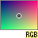

A 2D RGB axis picker for selecting two color channels at once
(for example: Red \* Green).

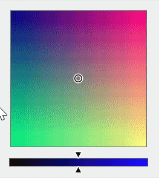

**Main properties:**
- `HorizontalKind`: Which channel maps to the horizontal axis (`Red`, `Green`, `Blue`).
- `VerticalKind`: Which channel maps to the vertical axis (`Red`, `Green`, `Blue`).
- `Red`, `Green`, `Blue`: Channel values (0..255) shown/edited by the picker.
- `HorizontalReverse`: Invert horizontal axis direction (left <-> right).
- `VerticalReverse`: Invert vertical axis direction (top <-> bottom).
- `HorizontalMin`, `HorizontalMax`: Minimum and maximum values for the horizontal axis.
- `VerticalMin`, `VerticalMax`: Minimum and maximum values for the vertical axis.
- `CurrentColor`: Helper property to get/set the combined RGB color.
- `AlphaPreview`: Alpha preview opacity used in range rendering.
- `RangeBackground`: Appearance settings for checkerboard/transparent settings.
- `Layout`: Visual layout for the axis picker (`OverlapThumb`, `InsideThumb`).
- `ThumbKind`: Thumb kind (`Circle`, `Cross`).
- `ThumbStyle`: Thumb rendering style (`Color`, `Invert`, `Mixed`).
- `ThumbSize`: Thumb size or auto behavior.
- `PositionLineVisible`: Show a position indicator line on the 2D range.

---

### TTurboHslLinePicker

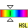

A linear picker for HSL components: `Hue`, `Saturation`, `Lightness`.

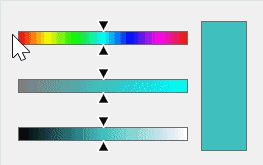

**Main properties:**
- `Hue`, `Saturation`, `Lightness`: HSL component values (0..1) edited by the control.
- `Kind`: Selected component (`Hue`, `Saturation`, `Lightness`).
- `Min`: Minimum value of the picker range.
- `Max`: Maximum value of the picker range.
- `Reverse`: Invert the value-to-position mapping.
- `CurrentColor`: Helper property to get/set the combined RGB color.
- `ColorModulation`: Enable color modulation in the range preview.
- `AlphaPreview`: Alpha preview opacity used in range rendering.
- `RangeBackground`: Appearance settings for checkerboard/transparent settings.
- `PreviewStyle`: Preview visualization style (gradient/lines) without color modulation.
- `Orientation`: Control orientation (`Horizontal`, `Vertical`).
- `Layout`: Visual arrangement of the thumb(s) and arrows (`ExternalArrows`, `InternalArrows`, `CenterArrows`, `OverlapBox`, `InsideBox`).
- `ThumbLayout`: Which thumbs are visible (`First`, `Second`, `Both`).
- `ThumbSize`: Thumb size settings (Width/Height or Auto).
- `PositionLineVisible`: Show a position indicator line on the range.
- `ForceRepaint`: Force immediate repaint when the picker or its range changes.

---

### TTurboHslAxisPicker

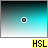

A 2D HSL axis picker for selecting two color components at once
(for example: Saturation \* Lightness).

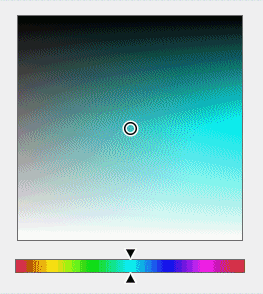

**Main properties:**
- `HorizontalKind`: Which channel maps to the horizontal axis (`Hue`, `Saturation`, `Lightness`).
- `VerticalKind`: Which channel maps to the vertical axis (`Hue`, `Saturation`, `Lightness`).
- `Hue`, `Saturation`, `Lightness`: Component values (0..1) shown/edited by the picker.
- `HorizontalReverse`: Invert horizontal axis direction (left <-> right).
- `VerticalReverse`: Invert vertical axis direction (top <-> bottom).
- `HorizontalMin`, `HorizontalMax`: Minimum and maximum values for the horizontal axis.
- `VerticalMin`, `VerticalMax`: Minimum and maximum values for the vertical axis.
- `CurrentColor`: Helper property to get/set the combined RGB color.
- `AlphaPreview`: Alpha preview opacity used in range rendering.
- `RangeBackground`: Appearance settings for checkerboard/transparent settings.
- `Layout`: Visual layout for the axis picker (`OverlapThumb`, `InsideThumb`).
- `ThumbKind`: Thumb kind (`Circle`, `Cross`).
- `ThumbStyle`: Thumb rendering style (`Color`, `Invert`, `Mixed`).
- `ThumbSize`: Thumb size or auto behavior.
- `PositionLineVisible`: Show a position indicator line on the 2D range.

---

### TTurboHsvLinePicker

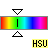

A linear picker for HSV components: `Hue`, `Saturation`, `Value`.

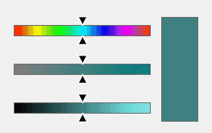

**Main properties:**
- `Hue`, `Saturation`, `Value`: HSV component values (0..1) edited by the control.
- `Kind`: Selected component (`Hue`, `Saturation`, `Value`).
- `Min`: Minimum value of the picker range.
- `Max`: Maximum value of the picker range.
- `Reverse`: Invert the value-to-position mapping.
- `CurrentColor`: Helper property to get/set the combined RGB color.
- `ColorModulation`: Enable color modulation in the range preview.
- `AlphaPreview`: Alpha preview opacity used in range rendering.
- `RangeBackground`: Appearance settings for checkerboard/transparent settings.
- `PreviewStyle`: Preview visualization style (gradient/lines) without color modulation.
- `Orientation`: Control orientation (`Horizontal` or `Vertical`).
- `Layout`: Visual arrangement of the thumb(s) and arrows (`ExternalArrows`, `InternalArrows`, `CenterArrows`, `OverlapBox`, `InsideBox`).
- `ThumbLayout`: Which thumbs are visible (`First`, `Second`, `Both`).
- `ThumbSize`: Thumb size settings (Width/Height or Auto).
- `PositionLineVisible`: Show a position indicator line on the range.
- `ForceRepaint`: Force immediate repaint when the picker or its range changes.

---

### TTurboHsvAxisPicker

A 2D HSV axis picker for selecting two color components at once
(for example: Saturation \* Value).

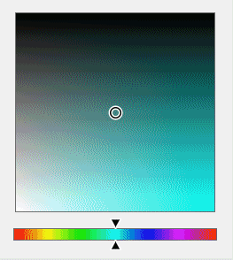

**Main properties:**
- `HorizontalKind`: Which channel maps to the horizontal axis (`Hue`, `Saturation`, `Value`).
- `VerticalKind`: Which channel maps to the vertical axis (`Hue`, `Saturation`, `Value`).
- `Hue`, `Saturation`, `Value`: Component values (0..1) shown/edited by the picker.
- `HorizontalReverse`: Invert horizontal axis direction (left <-> right).
- `VerticalReverse`: Invert vertical axis direction (top <-> bottom).
- `HorizontalMin`, `HorizontalMax`: Minimum and maximum values for the horizontal axis.
- `VerticalMin`, `VerticalMax`: Minimum and maximum values for the vertical axis.
- `CurrentColor`: Helper property to get/set the combined RGB color.
- `AlphaPreview`: Alpha preview opacity used in range rendering.
- `RangeBackground`: Appearance settings for checkerboard/transparent settings.
- `Layout`: Visual layout for the axis picker (`OverlapThumb`, `InsideThumb`).
- `ThumbKind`: Thumb kind (`Circle`, `Cross`).
- `ThumbStyle`: Thumb rendering style (`Color`, `Invert`, `Mixed`).
- `ThumbSize`: Thumb size or auto behavior.
- `PositionLineVisible`: Show a position indicator line on the 2D range.