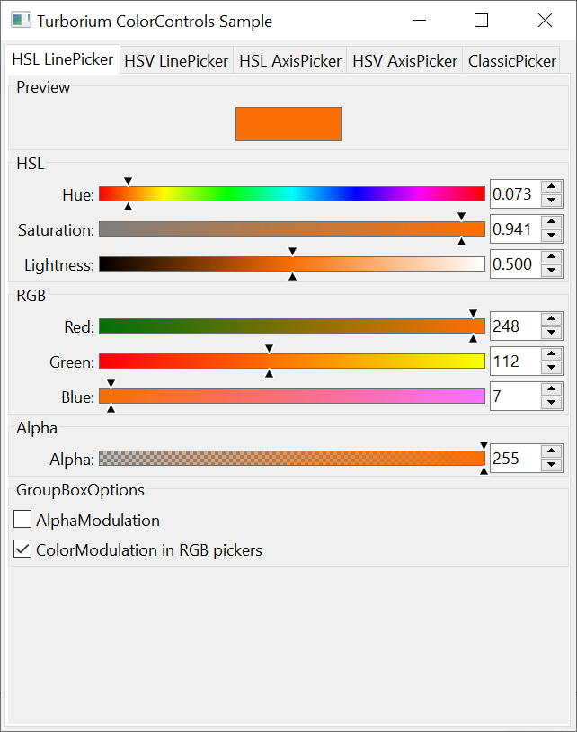
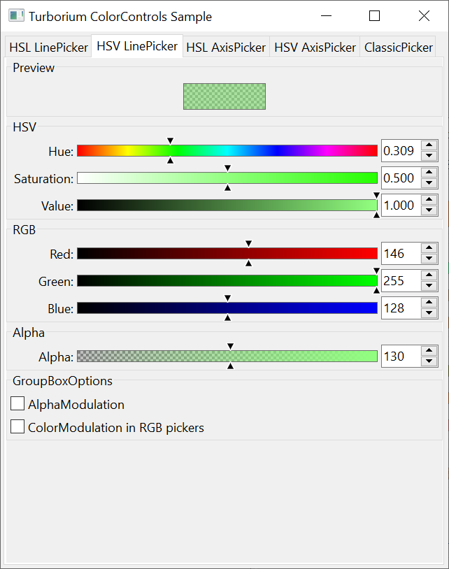
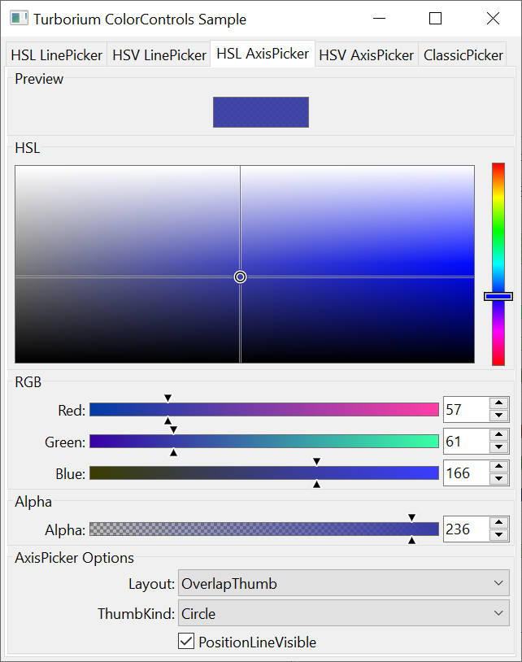
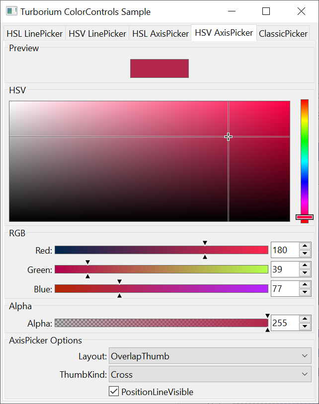
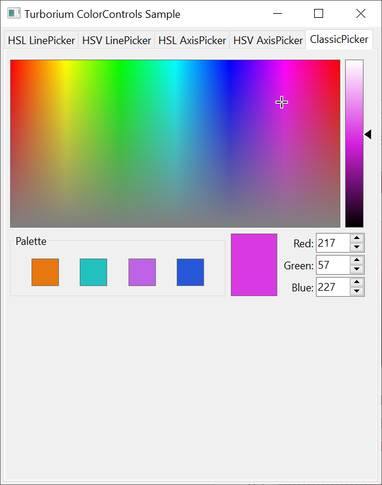

# ColorControls sample

This sample demonstrates TurboControls color picker components and how they work together: line pickers, axis pickers, RGB controls, alpha controls and color preview cells.

## Tab 1 — HSL LinePicker

### Components shown: 
`TTurboHslLinePicker`, `TTurboRgbLinePicker`, `TTurboAlphaLinePicker`, `TTurboColorCell`.

### What it demonstrates: 
How to edit color using separate linear sliders for Hue, Saturation and Lightness while keeping RGB controls synchronized.  
The `TTurboAlphaLinePicker` shows alpha handling and the `TTurboColorCell` shows the current preview.  
Example shows immediate synchronization between HSL and RGB controls and how alpha preview is applied across components.

## Tab 2 — HSV LinePicker

### Components shown: 
`TTurboHsvLinePicker`, `TTurboRgbLinePicker`, `TTurboAlphaLinePicker`, `TTurboColorCell` preview.

### What it demonstrates: 
Same interaction model as the HSL line pickers, but using HSV (Hue, Saturation, Value).  
Useful to see conversion between HSV and RGB and the effect of the value channel on the preview and RGB fields.

## Tab 3 — HSL AxisPicker

### Components shown: 
`TTurboHslAxisPicker` (2D axis for Saturation/Lightness), `TTurboHslLinePicker` for Hue, `TTurboRgbLinePicker` and `TTurboAlphaLinePicker`.

### What it demonstrates: 
A 2D axis picker for choosing S/L while adjusting Hue separately.  
The sample also exposes axis layout and thumb-kind options (via combo boxes) to show different rendering/layout modes and thumb styles.  
Shows how axis picker and line pickers integrate to produce a color.

## Tab 4 — HSV AxisPicker

### Components shown: 
`TTurboHsvAxisPicker` (2D axis for Saturation/Value), `TTurboHsvLinePicker` for Hue, `TTurboRgbLinePicker`, `TTurboAlphaLinePicker`.

### What it demonstrates: 
Similar to HSL axis picker but for HSV.  
Demonstrates 2D selection for S/V with independent Hue control and layout/thumb options.  
Also demonstrates synchronization with RGB controls and alpha preview.

## Tab 5 — ClassicPicker

### Components shown: 
`TTurboHslAxisPicker`, `TTurboHslLinePicker`, grid of `TTurboColorCell` palette items and a preview `TTurboColorCell`.

### What it demonstrates: 
A classic palette-style picker combining a palette of color cells with axis/line controls.  
Shows quick selection from preset cells, HSL-based adjustments and a live preview.  
Useful as an example of composing simpler controls into a compact color-selection UI.

